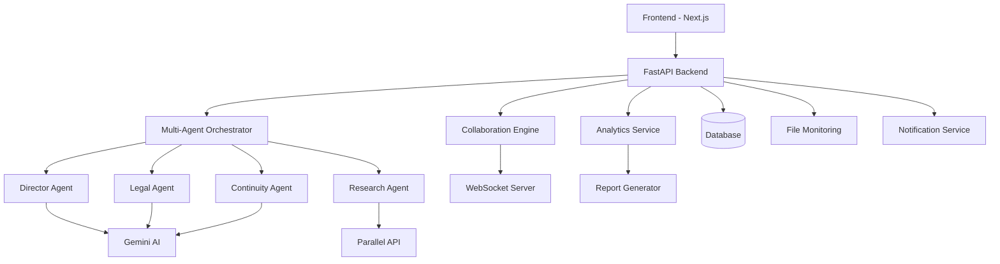

# Design Document

## Overview

This design document outlines the architecture for transforming Greenlit AI into a comprehensive film production assistant. The system will extend the existing multi-agent architecture with new production-focused features, real-time collaboration, advanced analytics, and automation capabilities.

The design maintains the existing cinematic theme while adding powerful workflow management tools that mirror real film industry practices.

## Architecture

### High-Level System Architecture



### New System Components

#### 1. Production Analysis Engine
- **Scene Parser**: Automatically detects screenplay formatting and splits scripts into scenes
- **Character Extractor**: Builds character profiles from script content using NLP
- **Risk Calculator**: Enhanced scoring that considers production impact and costs
- **Timeline Builder**: Creates visual scene sequences for continuity tracking

#### 2. Collaboration System
- **Real-time Sync**: WebSocket-based live updates for multi-user collaboration
- **Comment System**: Threaded discussions on specific claims and findings
- **Review Workflow**: Status tracking for issue resolution and sign-offs
- **User Management**: Role-based permissions for different production roles

#### 3. Analytics Dashboard
- **Data Aggregation**: Collects metrics across all analyzed scripts and projects
- **Trend Analysis**: Identifies patterns in risk scores and common production issues
- **Reporting Engine**: Generates professional reports and export formats
- **Alert System**: Smart notifications based on configurable thresholds

## Components and Interfaces

### Frontend Components

#### 1. Production Dashboard (`/dashboard`)
```typescript
interface DashboardData {
  projects: ProjectSummary[];
  analytics: {
    totalScripts: number;
    averageRisk: number;
    trendsData: TrendPoint[];
    recentActivity: Activity[];
  };
  notifications: Notification[];
}

interface ProjectSummary {
  id: string;
  name: string;
  lastAnalyzed: Date;
  riskScore: number;
  status: 'draft' | 'in-review' | 'production-ready';
  scenes: number;
  issues: {
    critical: number;
    warnings: number;
  };
}
```

#### 2. Scene Analysis View (`/report/[id]/scenes`)
```typescript
interface SceneBreakdown {
  sceneId: string;
  title: string;
  location: string;
  timeOfDay: string;
  characters: string[];
  riskScore: number;
  issues: ProductionIssue[];
  estimatedCost: CostEstimate;
  continuityFlags: ContinuityIssue[];
}
```

#### 3. Character Bible (`/report/[id]/characters`)
```typescript
interface CharacterProfile {
  name: string;
  descriptions: string[];
  appearances: SceneReference[];
  inconsistencies: ContinuityIssue[];
  notes: string;
}
```

#### 4. Collaboration Panel
```typescript
interface Comment {
  id: string;
  userId: string;
  userName: string;
  claimId: string;
  content: string;
  timestamp: Date;
  resolved: boolean;
  replies: Comment[];
}
```

### Backend Services

#### 1. Scene Analysis Service
```python
class SceneAnalysisService:
    async def parse_screenplay(self, script_text: str) -> List[Scene]
    async def analyze_scene_risks(self, scene: Scene) -> SceneRiskAnalysis
    async def extract_characters(self, scenes: List[Scene]) -> CharacterBible
    async def detect_continuity_issues(self, scenes: List[Scene]) -> List[ContinuityIssue]
```

#### 2. Collaboration Service
```python
class CollaborationService:
    async def add_comment(self, claim_id: str, user_id: str, content: str) -> Comment
    async def resolve_issue(self, issue_id: str, user_id: str) -> bool
    async def get_team_activity(self, report_id: str) -> List[Activity]
    async def notify_team(self, event: CollaborationEvent) -> None
```

#### 3. Analytics Service
```python
class AnalyticsService:
    async def calculate_trends(self, timeframe: str) -> TrendAnalysis
    async def generate_insights(self, projects: List[str]) -> ProductionInsights
    async def export_report(self, format: str, data: AnalysisData) -> bytes
```

## Data Models

### Enhanced Database Schema

#### Scripts Table
```sql
CREATE TABLE scripts (
    id UUID PRIMARY KEY,
    user_id UUID REFERENCES users(id),
    title VARCHAR(255) NOT NULL,
    content TEXT,
    status VARCHAR(50),
    risk_score DECIMAL(5,2),
    created_at TIMESTAMP,
    updated_at TIMESTAMP,
    version INTEGER DEFAULT 1
);
```

#### Scenes Table
```sql
CREATE TABLE scenes (
    id UUID PRIMARY KEY,
    script_id UUID REFERENCES scripts(id),
    scene_number INTEGER,
    location VARCHAR(255),
    time_of_day VARCHAR(50),
    description TEXT,
    risk_score DECIMAL(5,2),
    estimated_cost DECIMAL(10,2)
);
```

#### Characters Table
```sql
CREATE TABLE characters (
    id UUID PRIMARY KEY,
    script_id UUID REFERENCES scripts(id),
    name VARCHAR(255),
    description TEXT,
    first_appearance INTEGER,
    total_scenes INTEGER
);
```

#### Comments Table
```sql
CREATE TABLE comments (
    id UUID PRIMARY KEY,
    claim_id UUID,
    user_id UUID REFERENCES users(id),
    content TEXT,
    parent_id UUID REFERENCES comments(id),
    resolved BOOLEAN DEFAULT FALSE,
    created_at TIMESTAMP
);
```

## Error Handling

### Graceful Degradation Strategy
- **Agent Failures**: If individual agents fail, continue with partial results
- **API Timeouts**: Implement retry logic with exponential backoff
- **Real-time Connection Loss**: Fall back to polling for collaboration features
- **Export Failures**: Provide alternative formats when primary export fails

### Error Recovery
```python
class ErrorRecoveryService:
    async def handle_agent_failure(self, agent_type: str, error: Exception) -> PartialResult
    async def retry_with_backoff(self, operation: Callable, max_retries: int = 3) -> Any
    async def fallback_to_cache(self, key: str) -> Optional[CachedResult]
```

## Testing Strategy

### Unit Testing
- **Component Tests**: All React components with Jest and React Testing Library
- **API Tests**: FastAPI endpoints with pytest
- **Agent Tests**: Individual agent functionality with mocked AI services
- **Service Tests**: Business logic validation for new services

### Integration Testing
- **End-to-End Workflows**: Complete script analysis to collaboration flow
- **Multi-Agent Orchestration**: Parallel agent execution and result aggregation  
- **Real-time Features**: WebSocket communication and live updates
- **Export Generation**: PDF and data export functionality

### Performance Testing
- **Load Testing**: Multiple concurrent script analyses
- **Real-time Scalability**: WebSocket connection limits and message throughput
- **Large Script Handling**: Memory usage with feature-length screenplays
- **Database Performance**: Query optimization for analytics and reporting

### Testing Data Strategy
```python
# Test fixtures for realistic production scenarios
SAMPLE_SCRIPTS = {
    "action_thriller": "script with complex action sequences and locations",
    "period_drama": "historical script with many factual claims",
    "sci_fi": "technical script with scientific concepts",
    "indie_drama": "character-driven script with minimal technical requirements"
}
```

## Security and Privacy

### Authentication and Authorization
- **Role-Based Access**: Production roles (Director, Producer, Script Supervisor, etc.)
- **Project-Level Permissions**: Team members can only access assigned projects
- **API Security**: JWT tokens with proper expiration and refresh logic
- **Data Encryption**: Sensitive script content encrypted at rest

### Privacy Considerations
- **Script Confidentiality**: All script content treated as highly sensitive
- **User Data Protection**: Minimal data collection, GDPR compliance
- **Audit Logging**: Track access to scripts and sensitive operations
- **Secure File Handling**: Temporary file cleanup and secure upload processing

## Performance Optimization

### Frontend Optimizations
- **Code Splitting**: Route-based lazy loading for large dashboard components
- **Virtual Scrolling**: For large lists of claims, scenes, and comments
- **Optimistic Updates**: Immediate UI feedback for user interactions
- **Caching Strategy**: Redux Toolkit Query for efficient data caching

### Backend Optimizations  
- **Database Indexing**: Optimized queries for analytics and search
- **Background Processing**: Async task queue for heavy analysis operations
- **Result Caching**: Redis caching for frequently accessed analysis results
- **Connection Pooling**: Efficient database connection management

### Scalability Considerations
```python
# Async processing for heavy operations
class AsyncAnalysisQueue:
    async def queue_script_analysis(self, script_id: str) -> str
    async def get_analysis_status(self, job_id: str) -> JobStatus
    async def get_analysis_result(self, job_id: str) -> AnalysisResult
```

## Deployment and Infrastructure

### Enhanced Docker Configuration
```dockerfile
# Multi-stage build for optimized production image
FROM node:18-alpine AS frontend-builder
WORKDIR /app
COPY frontend/ .
RUN npm install && npm run build

FROM python:3.11-slim AS backend
WORKDIR /app
COPY backend/ .
COPY --from=frontend-builder /app/.next ./static/
RUN pip install -r requirements.txt
EXPOSE 8000
CMD ["uvicorn", "main:app", "--host", "0.0.0.0", "--port", "8000"]
```

### Infrastructure Components
- **Database**: PostgreSQL for production data persistence
- **Cache**: Redis for session management and result caching  
- **File Storage**: Google Cloud Storage for script files and exports
- **WebSockets**: Dedicated service for real-time collaboration
- **Task Queue**: Celery with Redis for background job processing

### Monitoring and Observability
- **Application Metrics**: Response times, error rates, user activity
- **Business Metrics**: Script analysis throughput, feature usage, user engagement
- **Error Tracking**: Comprehensive logging and alerting for production issues
- **Performance Monitoring**: Database query performance and API response times