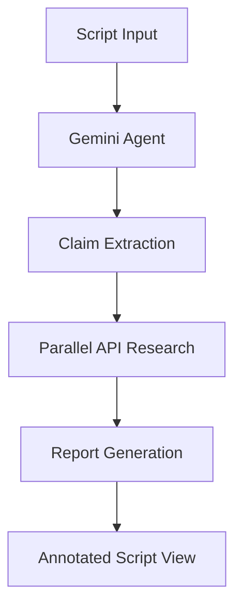

# 🎬 Greenlit AI

**AI-powered production research, before the cameras roll.**

A cinematic tool for film and TV production teams that extracts factual claims from scripts and researches them in real-time to ensure accuracy during pre-production.

[](https://opensource.org/licenses/MIT)
[](https://nextjs.org/)
[](https://fastapi.tiangolo.com/)

## ✨ Features

### 🎯 Core Functionality
- **Script Analysis**: Paste or upload scripts for instant fact-checking
- **AI-Powered Extraction**: Automatically identifies factual claims, historical references, locations, and technical details
- **Live Research**: Real-time verification using the Parallel API
- **Production Notes**: Structured reports with verification status, confidence scores, and sources
- **Script Supervisor View**: Annotated script display with inline claim highlighting

### 🎨 Design
- **Cinematic Theme**: Script supervisor's desk aesthetic with film motifs
- **Professional Feel**: Built for real production coordinators and researchers
- **Film Elements**: Sprocket borders, clapperboard icons, marquee lighting effects
- **Responsive**: Works seamlessly on desktop and mobile devices

## 🛠 Tech Stack

| Layer | Technology |
|-------|------------|
| **Frontend** | Next.js 14, TypeScript, Tailwind CSS |
| **Backend** | Python FastAPI |
| **AI/Agent** | Google Cloud Gemini Enterprise Agent Platform |
| **Research** | Parallel API |
| **Deployment** | Google Cloud Run (backend), Vercel (frontend) |
| **Styling** | Cinematic design with film grain textures |

## 🚀 Live Demo

🌐 **[Try Greenlit AI Live](https://greenlit-ai.vercel.app)**

*Upload a script excerpt and watch as AI identifies factual claims and researches them in real-time.*

## 📋 Use Cases

### For Production Teams
- **Script Development**: Verify historical accuracy during writing
- **Pre-Production**: Identify potential legal/licensing issues early
- **Fact Checking**: Research claims before filming begins
- **Location Scouting**: Verify geographical and architectural details

### For Content Creators
- **Historical Dramas**: Ensure period accuracy
- **Documentaries**: Verify factual claims and sources
- **Educational Content**: Double-check references and dates
- **Commercial Projects**: Flag brand mentions needing clearance

## 🎬 How It Works

1. **📝 Input**: Paste your script or scene description
2. **🤖 Analysis**: Gemini Enterprise Agent extracts factual claims
3. **🔍 Research**: Each claim is researched via Parallel API  
4. **📊 Report**: Get structured production notes with:
   - ✅ **Verified** claims with sources
   - ❌ **Flagged** inaccuracies needing attention
   - ❓ **Uncertain** claims requiring manual review

## 🏗 Architecture



### Data Flow
```
User Script → Gemini Enterprise → Claim Extraction → Parallel Research → Production Notes
```

## 🎯 Project Status

**Phase 7 Complete**: Cinematic design theme applied ✅
- Film supervisor aesthetic with sprocket borders
- Marquee text effects and film grain textures  
- Enhanced animations and cinematic color palette
- Production-ready styling

**Phase 8**: Demo and deployment ready 🚀

## 🔧 Local Development

### Prerequisites
- Node.js 18+
- Python 3.9+
- Google Cloud account (for Gemini Enterprise)
- Parallel API access

### Frontend Setup
```bash
cd frontend
npm install
npm run dev
```

### Backend Setup  
```bash
cd backend
pip install -r requirements.txt
uvicorn main:app --reload
```

### Environment Variables
Create `.env.local` files with:
```bash
# Frontend
NEXT_PUBLIC_API_URL=http://localhost:8000

# Backend  
GEMINI_API_KEY=your_gemini_key
PARALLEL_API_KEY=your_parallel_key
GOOGLE_CLOUD_PROJECT=your_project_id
```

## 🎪 Hackathon Details

**Event**: Agentic Cinema: The Blockbuster Hackathon  
**Tracks**: Google Cloud + Parallel API  
**Requirements Met**:
- ✅ Gemini Enterprise Agent Platform integration
- ✅ Parallel API real-time research calls
- ✅ Google Cloud Run deployment
- ✅ Open source MIT license

## 📝 API Documentation

### Analyze Endpoint
```http
POST /analyze
Content-Type: application/json

{
  "script_text": "Your screenplay content here..."
}
```

**Response**:
```json
{
  "report_id": "uuid",
  "claims": [
    {
      "id": "claim_uuid", 
      "text": "The Titanic sank in 1912",
      "type": "historical",
      "verdict": "verified",
      "confidence": 0.95,
      "sources": [{"title": "Titanic History", "url": "..."}],
      "note": "Accurate historical reference"
    }
  ]
}
```

## 🤝 Contributing

We welcome contributions! Please see our [Contributing Guidelines](CONTRIBUTING.md) for details.

1. Fork the repository
2. Create a feature branch (`git checkout -b feature/amazing-feature`)
3. Commit your changes (`git commit -m 'Add amazing feature'`)
4. Push to the branch (`git push origin feature/amazing-feature`)
5. Open a Pull Request

## 📄 License

This project is licensed under the MIT License - see the [LICENSE](LICENSE) file for details.

## 🙏 Acknowledgments

- **Google Cloud** for Gemini Enterprise Agent Platform
- **Parallel** for real-time research API
- **Film Industry** professionals who inspired the script supervisor aesthetic
- **Open Source Community** for the amazing tools and libraries

---

<div align="center">

**🎬 Ready to greenlight your next production with accurate research?**

[**Get Started →**](https://greenlit-ai.vercel.app)

*Built with ❤️ for filmmakers, by developers who care about storytelling.*

</div>